# HERO'S QUEST

**HERO'S QUEST** is a Python terminal roll playing game where the main goal is to save the princes that was taken by the evil dark elf that goes by the name Dralahi.

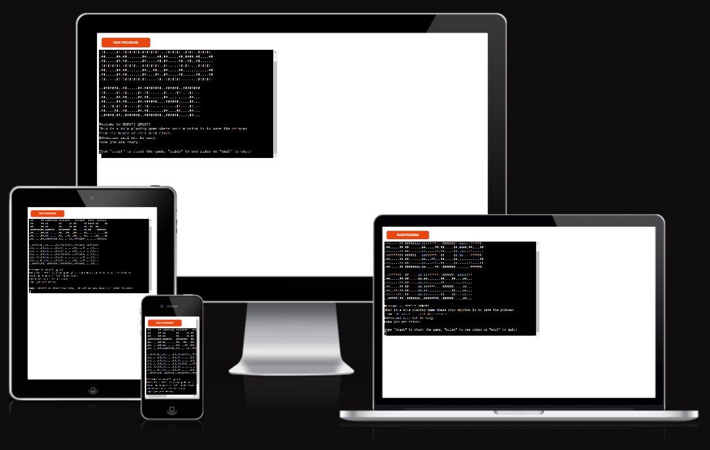

## How to play

At the beginning player can choose to either start the game, read the rules or exit before even trying the game.

If the player chooses to start the game, they choose the race they want to play with. It is either warrior or mage. After choosing the race, the player puts in the name they want to be called in the game. Once that is done, the game can begin.

Player will encounter various dangers that they need to defeat either by being lucky with the dice roll or by solving the riddle.

## Features

### Existing features

* At the start of the game:
    * Name of the game is presented
    * Player is asked if they want to start the game, read the rules or exit the game

    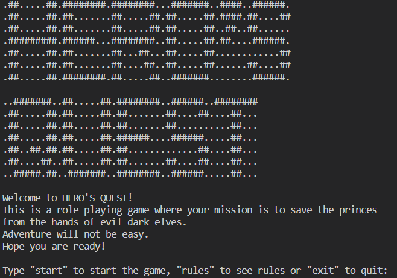

    * Story is printed to the terminal
    * Player chooses between two races: warrior or mage
    * Player types the name they want for the game

    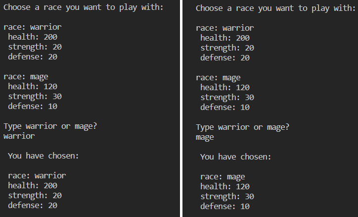

    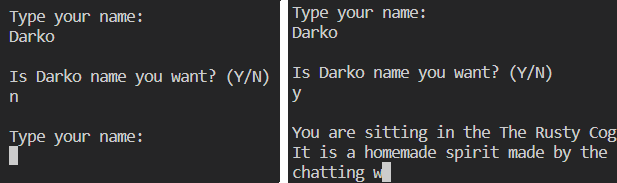

    * Player chooses if they want to save the princes

    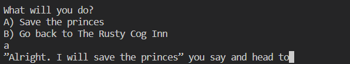

    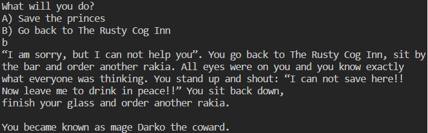

    * Player encounters python
    * Based on the dice roll, python gets killed or dodges the attack

    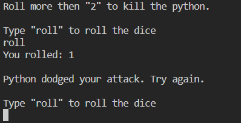

    * Player encounters the demon
    * Player needs to answer the riddle, otherwise they die

    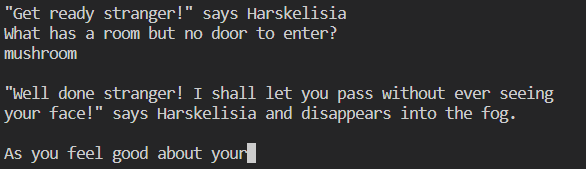

    * Player fights the evil dark elf by rolling the dice
    * Dice roll is generated automatically for the evil dark elf computer
    * Based on the dice roll, different outcome is printed to the terminal 

    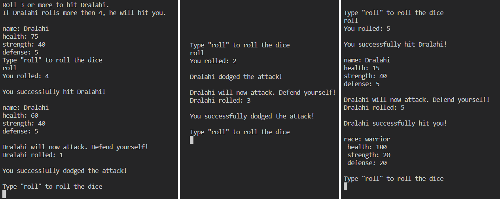

### Future features

* Random selection of attacks to be printed on terminal when player or enemy hits the other
* More adventures such as fighting live trees / bushes
* More races to choose from

## Data model
* Chart diagram created:
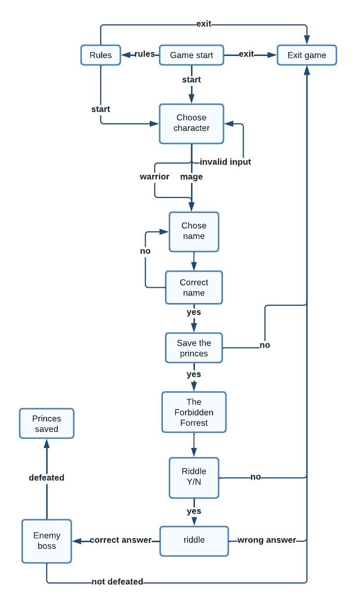

## Testing

I have manually tested this project by doing the following:
* Passed the code through CI Python Linter
* Given correct and invalid inputs to the questions – all passes as expected
* Tested in my local terminal and Code Institute Heroku terminal

### Bugs

*Solved bugs*
* method `message()` did not print the string letter by letter - fixed by adding `flush=True` to the code
* `kill_python()` method and `roll_dice()` wasn't working properly when dice rolled "1" - fixed this with the help of [stack overflow community ](https://stackoverflow.com/questions/75063734/reuse-the-same-function-until-dice-roll-is-higher/75065406#75065406) and created another method 
with while loop to fix the issue
* `battle()` method did not stop with either Dralahi or the player getting to "0" health - fixed with the help of [stack overflow community](https://stackoverflow.com/questions/75121587/stop-running-function-when-one-variable-gets-to-zero?noredirect=1#comment132565518_75121587) and by adding another condition to `while` loop

*Remaining bugs*
* no remaining bugs

### Validator testing
* Five “E501 line too long” errors, but this does not affect the game in the local or Code Institute Heroku terminal 

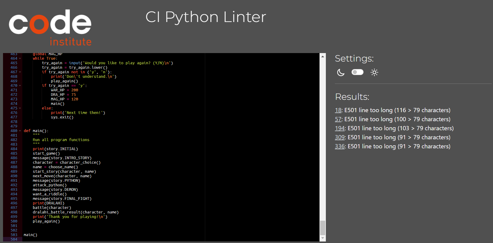

## Deployment

* This project was deployed using Code Institute’s mock terminal for Heroku
* Create an Heroku account
* Create a new app on Heroku
* Set the buildpacks to Python and NodeJS in that order
* Link the Heroku app to the repository
* Click on *Deploy**

## Credits

* Character class based on user input: [stack overflow](https://stackoverflow.com/questions/50065610/python-3-6-user-input-call-class-variable)
* Time delay for printing the story: [geeksforgeeks](https://www.geeksforgeeks.org/how-to-add-time-delay-in-python/)
* Heading for the game: [patorjk.com](https://patorjk.com/software/taag/#p=display&f=Graffiti&t=Type%20Something%20)
